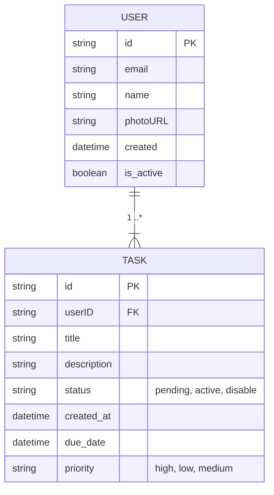

# Diagrama Entidad-Relación

```mermaid
erDiagram
    USER ||--|{ TASK : "1 ..*"

    USER {
        string id PK
        string email
        string name
        string photoURL
        datetime created
        boolean is_active
    }

    TASK {
        string id PK
        string userID FK
        string title
        string description
        string status "pending, active, disable"
        datetime created_at
        datetime due_date
        string priority "high, low, medium"
    }
```
